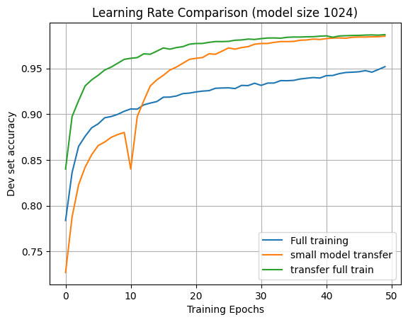

******************** WORK IN PROGRESS (Draft 0) *********************


# Bootstrapped Up Scaling (BUS) / The Student Becomes the Teacher
## Abstract

The objective of this research is to explore whether knowledge learned by a smaller Transformer model can be transferred to a larger one. This could significantly improve the efficiency of training Large Language Models (LLMs) by reducing the computational cost associated with pretraining, which often involves extensive matrix multiplications. By investigating the possibility of pretraining a smaller model and then scaling it up to a larger architecture, bootstrapped  up scaling (BUS), we aim to identify potential time- and cost-saving strategies for LLM training.

## Introduction
The pretraining of LLMs has become increasingly computationally expensive, requiring vast amounts of memory and processing power. A key factor contributing to this challenge is the sheer size of the models themselves, which necessitate extensive matrix multiplications during training. This paper explores a potential solution to mitigate these costs by investigating whether knowledge learned by smaller Transformer models can be transferred to larger ones, enabling more efficient training of LLMs.

## Background

The motivating idea behind this is the Singular Value Decomposition (SVD). SVD enables the condensation of large matrices into smaller ones through linear dimensionality reduction. This raises an intriguing question: if we can shrink a large matrix to a smaller one, can we also scale up from small to large? While perfect reconstruction is unlikely, might it be possible to transfer some information from the smaller matrix to its larger counterpart?

This idea is inspired by the observation that both smaller and larger models are tackling the same problem, suggesting they share common characteristics. Notably, they exhibit similar approximate eigenvalues. As smaller matrices struggle to capture optimal solutions due to limited dimensionality, their training can drive them closer to the eigenvalues of the larger matrix. This implies that the smaller model learns a lower-dimensional projection of the full solution.

The next challenge lies in developing a method to scale up this lower-dimensional solution to a larger matrix, effectively "inflating" the smaller model's capabilities.

## Methodology
As a proof of concept, a relatively simple task was chosen such that it can be trained locally and quickly. The model used was also small by design to provide give an easy way to compare learning rates.

### Test
To test the BUS capabilty of transformers a simple task was used to test transformer learning. This task is one that a transformer would excel at in comparison to other machine learning models/architectures.

### The Task

The objective of this task is to develop a predictive model that, given a string of characters, outputs the frequency count of each character at its corresponding position. The goal is to predict the number of times a particular character has occurred before, with a maximum count of 2. This makes it a 3 class classification problem.

This task serves as an ideal benchmark for evaluating the performance of various models, particularly transformer-based architectures. It can be learned with a single-headed transformer layer without requiring multiple layers or large neural networks. Consequently, the performance of the model is directly proportional to that of the underlying transformer architecture.

The self-attention mechanism inherent in transformers enables them to effectively "look back" at the input sequence, making this task particularly well-suited for evaluation purposes.

**Example Inputs**

Below are two example inputs:

```
we propose a new simp
000000110110202021002
men love the downfall
000000011002201010001
```
In each example, the output should indicate the frequency count of each character at its corresponding position.

**Training Set Specifications**

Each string in the training set will consist of 20 characters. The vocabulary is limited to English letters and spaces, with numbers represented as individual digits (e.g., "10" becomes "one zero").

<!-- The task is given a string of characters, the model must learn to predict, for each position in the string, how many times the character at that position occurred before, maxing out at 2. This 3-class classification problem is an easy task to set up testing data for to compare results. This is becuase the task can be learned with only 1 single-headed transformer layer without using multiple layers or large neural networks on top of the model. The performance of the transformer is directly preportional to the performance of the model.  -->
<!-- This task is also specifically chosen since a transformer would particularly benefit from "looking back" in the input with its' self-attention.  -->
<!-- Below is a sample: -->
<!---->
<!-- The majority cannot reason; it has no judgment.<br> -->
<!-- 00000000001010101122112022021222212222100012220 -->
<!---->
<!-- For each character, the output should be the number of times that character has occurred before. -->
<!---->
<!-- men love the downfall and disgrace of the righteous<br> -->
<!-- 000000011002201010001212121000020222121122111222201 -->
<!---->
<!-- For this example we extended the length of the string to demonstrate the rule. In the training set each string will be 20 characters long as demonstrated below. the vocab is also limited to the english letters and space. Numbers are spelled out as individual digits (10 becomes one zero). -->
<!---->
<!-- the majority cannot r<br> -->
<!-- 000000000010101011221 -->
<!---->
<!-- men love the downfall<br> -->
<!-- 000000011002201010001 -->
<!---->
### The dataset
The dataset was taken from text8.


### Model Architecture
test


### Steps 
- attempted doubling every col and row
    - unsuccessful attempt, no learning improvement
- adding one hot vectors to each matrix to expand it that way
    - this works, knowlede from a 
    - test protocol:
        - Train a transformer for 20 epochs at half the size n/2
        - expand the transformer to full size by simply adding it to the n sized identity
        - train for an additional 30 epochs
        - train a seperate model at full size n for 50 epochs
        - compare average dev set accuracy
        - this test was performed 25 times and averaged     
        - test still needs to be performed more to obtain a statistically valid result
    - results:
        - with smaller models that acheive worse performance, there seems to be little to no improvement, this is with matrix sizes of <64
        - with larger models, the improvement is larger


## Results

| Model size (d_model) | Dev set accuracy | Dev accuracy (transfer learning) | Transfer Improvement |
|:--------------------:|:----------------:|:--------------------------------:|:--------------------:|
| 64 | 81.42% | 86.81% | +5.39% |
| 128 | 87.99% | 93.60% | +5.61% |
| 256 | 91.23% | 96.82% | +5.59% |
| 512 | 92.31% | 97.72% | +5.41% |
| 1024| 93.70% | 99.10% | +5.40% |




### Expansion to Larger Task

### Statistical Analysis

## Analysis
- standard deviation of the non-boostrapped model is much higher, suggesting that it's taking much longer to converge

### Attempts to disprove
- Possibly effect of identity matrix initialization
    - using an identity initalization for the matrices performs about equal to standard torch.nn.linear init

### Optimal transfer training stopping

### Limitations

## Conclusion


## References
******************************* workspace ******************************

## Personal Notes

- if generally a transformer learns via gradient descent, and you are training two models on the same problem, if one model is smaller than the other then isn't the smaller model learning a projection of the problem space in a lower dimension?
- if that is the case then the there could be some overlap in the solutions that can be found as you scale the model up, since it'll get a higher resolution image of the terrain of the problem space
- for example, if you take a paraboloid and project it onto a 2d plane, you can get different perspectives of the problem, some useful and some not so useful, but of the useful ones, the low dimensional solution does share some information with the full dimensional solution
- what does it mean for two matrices to have the same singular values?
- Since these matrices all seem to converge to the same singular values there must be something that they are all converging to 
- If they share singular values does that mean that we can construct a new larger matrix based on the singular values of the smaller matrix that will be closer to the solution for the larger matrix?


<!-- - TODO: -->
<!--     - compare what kind of transfer learning is best -->
<!--     - compare transfer training ratio -->
<!--     - compare ammount of transfer training -->
<!--     - plot the training rates (dev set accuracy) -->
<!--         - compare epoch to epoch  -->
<!--         - compare epoch to epoch for same model size -->
<!--         - the transfer learning should show a much sharper learning rate -->
<!--         - also compare training loss? why not  -->
<!--    - See if there is an improvement on the efficient compute boundary with this approach? -->


